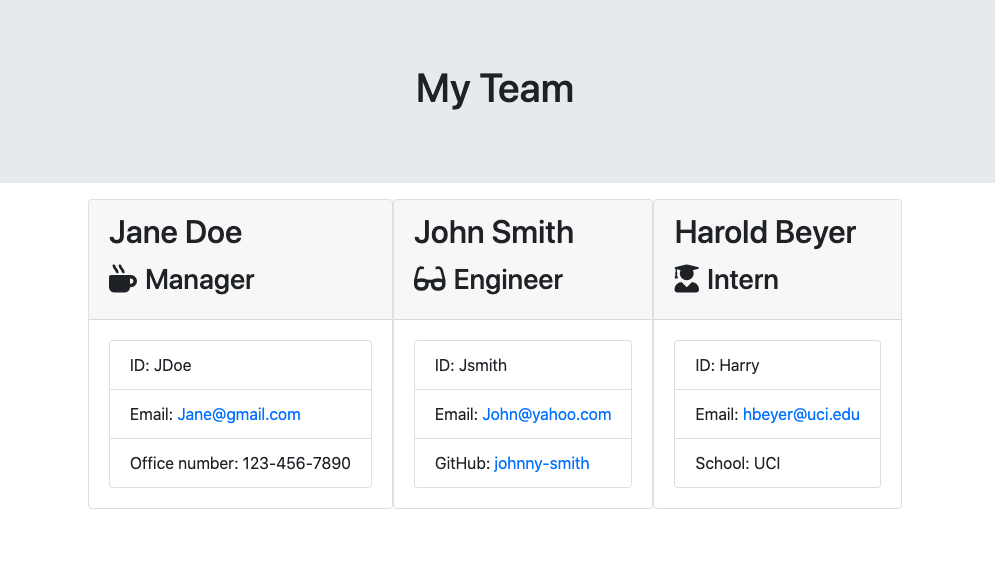
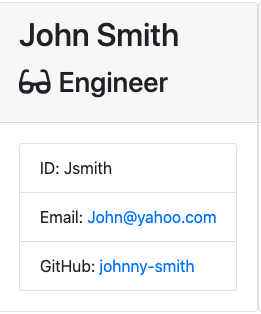
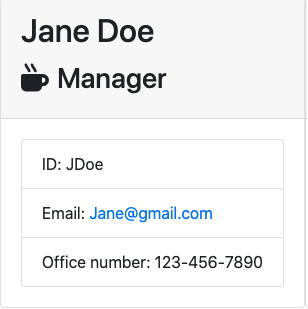

# Template-Engine

## Description
This repository contains the code used to create a software engineering team generator. The generator allows the user to easily build their team and create a styled html page containing the employee data. The 'team.html' located in the 'output' folder serves as an example html file of an engineering team generated using the application.

## Technologies
Project is coded in:
* Javascript
* node.js
* html

## Dependencies
* [Inquirer package](https://www.npmjs.com/package/inquirer)
* Jest (Dev Dependency)

## Installation
In order to install necessary dependencies, please run the following command:
npm i inquirer

## Functionality

## Preview

Command to initialize program

Example of generated team page

Example of generated engineer card

Example of generated manager card

Example of generated intern card

### Links
[Link to walkthrough video](https://www.dropbox.com/s/3idgxgdqf0sohb7/readme-generator%20walkthrough.mov?dl=0)